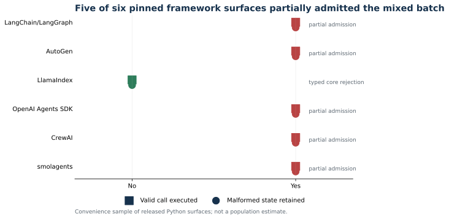

# Continuous Cognition, Failure-Atomic Actuation

[](RELEASE_NOTES.md)
[](LICENSE)
[](LICENSES/CC-BY-4.0.txt)

**Andrew Gracey, Independent Researcher**

This repository contains the paper, evidence, deterministic experiments, and
figures for a narrow execution-safety invariant:

> Cognition remains continuous; tool admission is atomic; side effects are
> committed individually.


Tool-using systems often parse and dispatch generated calls sequentially. If a
response contains one valid call followed by malformed JSON, the first effect
can commit before the second call fails. This work separates narrative content
from action frames and validates the complete action batch before admitting
any call to executable history or dispatch.

## Results

| Evaluation | Sequential baseline | Failure-atomic candidate |
|---|---:|---:|
| Nonterminal byte cuts tested | 107 | 107 |
| Cuts causing a partial effect | 107 | 0 |
| Cuts contaminating action history | 107 | 0 |
| Completed narrative retained after rejection | No | Yes |
| Ambiguous execution reported as unknown | No | Yes |

A pinned probe of six released Python framework surfaces found partial
admission in five. The tested LlamaIndex core type structurally rejected raw
malformed arguments; provider-adapter behavior remains unresolved. This is a
convenience sample, not an ecosystem-wide prevalence estimate.



## Read the Paper

- [Manuscript PDF](paper/paper.pdf)
- [Manuscript source](paper/paper.md)
- [Release notes](RELEASE_NOTES.md)
- [Evidence manifest](evidence_manifest.json)

## Reproduce

The deterministic boundary experiment needs only Python 3.10 or newer:

```bash
python artifact/run_fault_injection.py
pytest -q
```

Regenerate the figures and paper:

```bash
python -m pip install -r requirements-dev.txt
python scripts/generate_figures.py
python scripts/build_paper.py
python scripts/build_manifest.py
```

The framework probe has a larger isolated dependency set:

```bash
python -m venv .venv-frameworks
. .venv-frameworks/bin/activate
python -m pip install -r artifact/framework_prevalence_requirements.txt
python artifact/run_framework_prevalence.py
```

`artifact/framework_prevalence_lock.txt` records the complete environment used
for the released result. Exact framework versions and source digests are also
embedded in the result JSON.

## Repository Layout

- `paper/`: manuscript source, PDF, and bibliography
- `artifact/`: deterministic harness, framework probe, and exact results
- `evidence/`: sanitized incident record and reference runtime ordering
- `figures/`: generated SVG, PNG, and PDF figures
- `scripts/`: figure, manuscript, and manifest builders
- `tests/`: artifact and claim-contract tests

## Claim Boundary

This release establishes an admission-boundary counterexample and evaluates a
candidate protocol in a deterministic harness. It does not claim:

- rollback of arbitrary external side effects;
- population prevalence across all agent frameworks;
- end-to-end improvement in model task quality;
- a production streaming-runtime implementation;
- proof about consciousness or personhood.

Those limits are part of the result, not footnotes to it.

## Citation

Use the tagged release as the citation unit. GitHub can read
[`CITATION.cff`](CITATION.cff) directly. After the first public release is
archived with Zenodo, the DOI can be added without changing the v0.1.0 record.

## Rights and Attribution

Copyright 2026 Andrew Gracey.

Code, tests, and executable artifacts are licensed under Apache License 2.0.
The manuscript, figures, and documentation are licensed under Creative
Commons Attribution 4.0 International. See [LICENSES/README.md](LICENSES/README.md)
for the file-level mapping.

Copyright exists independently of the license. The licenses grant defined
reuse rights while preserving attribution and notice requirements. They do not
transfer authorship or ownership of this work.
