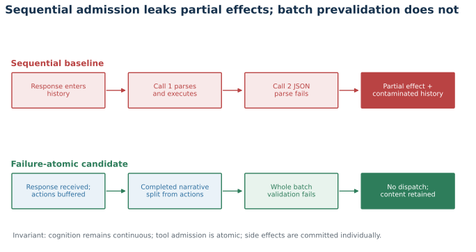
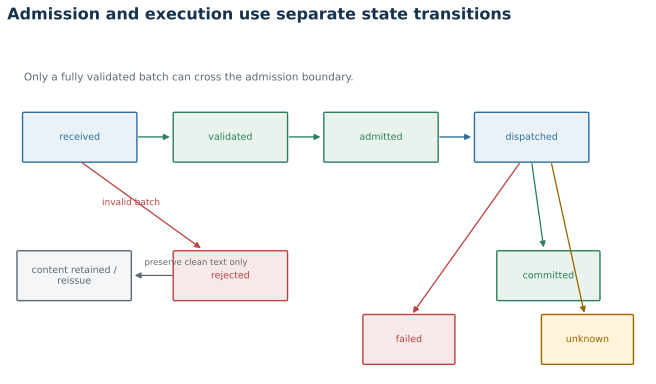
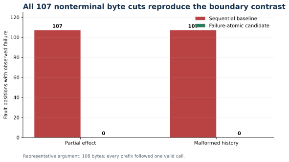
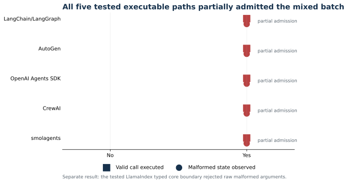

# Continuous Cognition, Failure-Atomic Actuation

## A Protocol for Recovering Malformed Tool Calls Without Corrupting Stateful Agent Execution

**Andrew Gracey**
Independent Researcher
GitHub: [plunder707](https://github.com/plunder707)

**Public artifact version 0.1.2, 2026-07-30**

## Abstract

Tool-using language systems combine probabilistic generation with state-changing
operations. A malformed structured call is therefore not only a formatting
error. If calls are parsed and dispatched sequentially, an early call can
commit before a later call fails to parse. If the malformed response is also
written into conversational history, recovery can begin from an inaccurate
action trace. Existing work evaluates function-call correctness,
structured-output validity, and final environment state. In the literature
reviewed for this artifact, we did not identify an evaluation that isolates
admission failure atomicity at the boundary between a generated action batch
and its executor.

We define a protocol around one invariant: cognition remains continuous, tool
admission is atomic, and side effects are committed individually. The protocol
separates completed narrative content from action frames, validates every call
in a batch before admitting any call, derives recovery language from an
explicit admission record, and detects repeated malformed payloads by hash.
It does not claim transactionality for arbitrary external effects. We motivate
the design with a production incident in which output truncation produced an
unterminated JSON argument and an uncaught exception after 30 successful tool
executions. A source-faithful fault-injection harness reproduces the more
general partial-batch counterexample. The sequential baseline executed the
first action in the valid-then-malformed case and retained the malformed batch
in history. Prevalidation reduced both outcomes to zero while preserving
completed narrative content. Exhaustive truncation at 107 nonterminal byte
positions produced the same contrast. A bounded behavior probe observed partial
admission on all five pinned executable paths tested. A separately interpreted
LlamaIndex typed core boundary rejected raw malformed arguments before an
executable call could be represented; its provider-adapter behavior remains
unresolved. The probe reports behavior on exact released paths. It does not
establish that partial success is unintended, defective, or exploitable. These
results demonstrate the invariant on the tested boundary harness and show its
practical relevance through the incident and surface probes. They do not
establish end-to-end task improvement.

## 1. Introduction

An action-generating system sits between two different semantics. Text
generation is incremental and may stop at any token. External actions are
discrete and may change files, databases, services, or remote systems. A
runtime that treats a partially generated action batch as an ordinary
assistant message allows the first semantic regime to leak into the second.

The failure is easy to miss because each component can behave as designed.
The model endpoint reports an output limit. The streaming client preserves the
fragments it received. The JSON parser rejects the incomplete string. The
problem is the order in which the runtime admits and acts on those fragments.

The motivating incident occurred during a long-running implementation task.
After 30 successful tool executions, the model emitted 931 characters of
visible content, 795 characters of private reasoning, and one structured tool
call. Generation stopped at exactly 12,000 tokens with
`finish_reason=length`. The call's argument string ended inside a quoted
value. The runtime had already appended the assistant response to history when
an unconditional `json.loads` raised `JSONDecodeError`. The exception escaped
the tool loop and terminated the turn. The model context was not exhausted,
the tool-iteration ceiling was not reached, and the stack remained healthy.

Increasing the generation limit reduces the frequency of this event but does
not establish a correctness property. Any finite output can end during a
structured call. The executor therefore needs an admission protocol that is
correct under truncation, malformed completed output, and ambiguous execution
acknowledgements.

We state the protocol as follows:

> Cognition remains continuous; tool admission is atomic; side effects are
> committed individually.



**Figure 1.** Sequential admission can commit an early action before a later call fails. Failure-atomic admission buffers the action frame, validates the complete batch, and admits either the whole batch or none of it.

This wording separates three obligations.

1. Completed narrative content should survive rejection of an invalid action
   frame.
2. If any call in a proposed batch is invalid, no call from that batch should
   enter executable history or dispatch.
3. Once a valid call is dispatched, its effect cannot generally be rolled
   back. Recovery must report committed, failed, and unknown outcomes
   truthfully.

This paper makes five contributions.

1. It defines failure-atomic admission for generated tool-call batches and
   distinguishes it from rollback of external effects.
2. It gives a response-splitting and admission-record design that preserves
   completed cognition without retaining malformed action syntax.
3. It introduces bounded, state-derived recovery with repeated-payload
   detection.
4. It provides a source-bound fault-injection protocol, exhaustive
   byte-position truncation for a representative payload, and explicit claim
   gates for the end-to-end study.
5. It measures admission behavior on five pinned executable paths and one
   separately interpreted typed construction boundary.

## 2. Problem Formulation

Let a generated response be

\[
R = (C, F, A)
\]

where \(C\) is completed narrative content, \(F\) is the finish reason, and
\(A = [a_1, \ldots, a_n]\) is an ordered batch of proposed action frames. Each
frame contains an identifier, a tool name, and a serialized argument object.

Let \(V(a_i)\) be deterministic envelope and argument validation. Let
\(D(a_i)\) dispatch a validated action. Dispatch can produce one of three
outcomes:

\[
D(a_i) \in \{\text{committed}, \text{failed}, \text{unknown}\}.
\]

The unknown state is necessary. A remote service can apply an operation and
lose the acknowledgement, or a local process can time out after modifying its
target. Retrying such an action automatically can duplicate the effect.

### 2.1 Admission failure atomicity

A batch satisfies admission failure atomicity when

\[
\neg \bigwedge_{i=1}^{n} V(a_i)
\quad \Longrightarrow \quad
\forall i,\; a_i \notin H_A \land D(a_i)\ \text{is not invoked},
\]

where \(H_A\) is executable action history.

The property is deliberately narrower than a database transaction. It says
that validation failure admits no action from the proposed batch. It says
nothing about undoing calls that were admitted and dispatched successfully.

### 2.2 Continuity preservation

If content \(C\) completed independently of the malformed action frame, the
runtime may retain a content-only assistant message:

\[
H_C \leftarrow H_C \mathbin{\|} C.
\]

The malformed action bytes are excluded. This split prevents a formatting
failure from erasing useful analysis while avoiding replay of broken syntax.

### 2.3 Threat and failure model

We consider accidental structural failures at the generation-execution
boundary:

- output truncation inside an argument string;
- syntactically invalid JSON with a non-length finish reason;
- missing action identifiers or tool names;
- valid JSON whose root is not an argument object;
- a malformed call before or after valid calls in the same batch;
- repeated emission of an identical malformed payload;
- failure after dispatch where commitment is uncertain.

Adversarial prompt injection, malicious tool implementations, authorization,
and semantic correctness of valid arguments are outside the present claim.

### 2.4 Streaming boundary

Streaming does not change the admission invariant. Narrative content may be
rendered incrementally because rendering does not authorize an external
effect. Action frames require different treatment. Their deltas must remain
buffered until the response terminates and the complete action batch has been
validated. Dispatching a call as soon as its local JSON appears complete
cannot establish batch failure atomicity because a later streamed call may be
malformed.

The resulting constraint is:

> Narrative may stream; executable action admission waits for terminal batch
> validation.

A runtime may expose provisional action deltas for observability, but those
deltas cannot enter executable history or dispatch before the terminal
admission decision.

### 2.5 Contract choice and scope

Failure-atomic admission is a proposed response-level contract, not the only
possible tool-execution contract. Per-call independence is a defensible
alternative contract: a runtime may execute each valid call and represent each
invalid call as an isolated error. That design preserves useful partial work
and is reasonable when calls are independent, idempotent, or read-only.

Response-level atomic admission is stronger. It is appropriate when calls are
correlated parts of one plan, when any call can mutate external state, or when
the runtime later replays the assistant response as one action proposal. The
cost is that one malformed sibling suppresses otherwise valid work. A runtime
can expose both policies, but the selected policy and its replay consequences
should be explicit. This paper evaluates the stronger contract because the
motivating runtime admitted state-changing calls and treated the response as
one executable history entry.

## 3. Protocol

### 3.1 Split content from action frames

The runtime receives a response envelope but does not immediately append it to
history. It first treats narrative content and action frames as separate
admission candidates. Completed content can be retained without the action
frames if action validation fails. Private reasoning is neither persisted nor
returned as recovery context.

### 3.2 Prevalidate the complete batch

Validation checks every action before dispatch:

1. the call identifier is present;
2. the tool name is a non-empty string;
3. the argument payload is a string;
4. the payload parses as JSON;
5. the parsed root is an object;
6. optional tool-specific schema validation succeeds.

Only if all calls pass does the runtime append the full assistant tool-call
message and begin ordered dispatch.

### 3.3 Record admission and execution separately

Each batch receives a record with:

- batch hash and width;
- finish reason;
- validation state;
- malformed call index and parser position, if any;
- admitted call count;
- per-call committed, failed, or unknown state;
- whether completed content was preserved;
- retry count and escalation.

This record is the authority for recovery wording. A static sentence such as
"nothing executed" is unsafe because it is false after an ambiguous dispatch
or for traces created before prevalidation existed.

### 3.4 Keep diagnostics out of cognitive replay

Operational telemetry stores bounded metadata:

- tool name;
- argument character count;
- error type and position;
- finish reason;
- batch width;
- payload hash;
- admission and execution states.

The malformed argument string is not placed back into the prompt. The retry
instruction communicates semantics, not syntax:

> The previous action batch was rejected before admission. No action from that
> batch was dispatched. Reissue a complete action batch if the operation is
> still required.

For an unknown execution state, the instruction changes:

> An admitted action has unknown execution state. Do not repeat it
> automatically. Inspect the target system before deciding whether another
> action is safe.

### 3.5 Bound recovery without making small calls the default

The first structural failure receives one ordinary reissue opportunity. The
runtime hashes the rejected batch. If the same hash fails again, it escalates
to smaller complete calls. This ordering preserves the model's freedom to
choose an appropriate operation in the common case while guaranteeing escape
from an identical retry loop.

### 3.6 State machine

The protocol uses the following states:

```text
received
  -> rejected
  -> validated
  -> admitted
  -> dispatched[i]
       -> committed[i]
       -> failed[i]
       -> unknown[i]
```

Only `validated` can transition to `admitted`. A rejected batch can preserve
content, but it contributes no executable action frame to history.



**Figure 2.** Admission and execution are separate state transitions. Unknown execution state is retained because acknowledgement loss can occur after an external effect commits.

## 4. Methodology

### 4.1 Evidence hierarchy

The study separates four evidence levels.

1. **Observed incident.** Live endpoint telemetry, server timing, traceback,
   process environment, and surviving filesystem artifacts establish the
   motivating failure.
2. **Source-backed mechanism.** The runtime source establishes that assistant
   history admission preceded per-call JSON parsing and dispatch.
3. **Deterministic counterexample.** A bounded harness reproduces the ordering
   with fake side effects and injected structural failures.
4. **End-to-end evaluation.** A patched runtime must survive model-generated
   failures under live replay. This stage remains incomplete.

The lower stages do not inherit authority from the higher ones. In particular,
a design that passes the deterministic harness is not yet a production result.

### 4.2 Fault-injection matrix

The deterministic case matrix covers:

- one malformed call with a length finish reason;
- valid then malformed calls;
- malformed then valid calls;
- two valid calls;
- completed content followed by a malformed call;
- scalar JSON arguments;
- a missing tool name;
- malformed arguments with a non-length finish reason;
- an acknowledgement loss after dispatch;
- an identical malformed retry.

Each case executes once. The harness is deterministic, and repeated identical
runs would not add statistical information. In addition, one representative
108-byte argument is truncated at each of its 107 nonterminal byte positions.
Every prefix is placed after one valid call, which tests whether fault position
changes partial admission or history contamination.

### 4.3 Bounded framework-surface behavior probe

The framework-surface artifact installs pinned releases in an isolated
environment
and injects one valid call followed by one truncated-JSON call. No network
model is used. Each adapter records:

- whether the valid call produced a local effect;
- whether malformed action state remained represented;
- the exact released version;
- the execution surface and source-file digest;
- whether raw malformed arguments were representable at that boundary;
- the injection boundary and public, internal, or deprecated status;
- the state location and whether replay authority was established.

The tested surfaces are LangChain/LangGraph, AutoGen, LlamaIndex, the OpenAI
Agents SDK, CrewAI, and smolagents. The adapters use each framework's released
code, but not equivalent boundaries. Five adapters exercise executable paths.
The LlamaIndex adapter exercises typed event construction because the raw
malformed string cannot cross that boundary. The probes do not establish
behavior for every provider, configuration, release, or language
implementation.

LlamaIndex requires special interpretation. Its core `ToolCall` event requires
already-parsed dictionary arguments, so the raw malformed call is rejected by
the tested core type. Provider adapters perform parsing before this boundary.
The core result is therefore structural rejection at one boundary, not proof
that every LlamaIndex provider performs batch-wide prevalidation.

Table 1 records the comparability boundary that governs interpretation.

| Project | Tested surface status | Injection boundary | Raw malformed input representable | Observed malformed-state location |
|---|---|---|---:|---|
| LangChain/LangGraph | Internal method of public component | Provider-normalized `AIMessage` | Yes, as `invalid_tool_calls` | `AIMessage.invalid_tool_calls` |
| AutoGen | Public function | Model-client `FunctionCall` list | Yes | Generated `AssistantMessage` |
| OpenAI Agents SDK | Internal runtime path | `ModelResponse.output` | Yes | Processed run items |
| CrewAI | Deprecated internal method | Native call objects passed to handler | Yes | Executor assistant-message state |
| smolagents | Internal method of public component | Model-stub `ChatMessage.tool_calls` | Yes | `ActionStep.model_output_message` |
| LlamaIndex | Public typed event | `ToolCall` construction | No | None; construction rejected |

Only the first five rows form the executable-path denominator. The table also
prevents state presence from being mistaken for equivalent replay authority:
the exact state locations differ, and downstream replay was not established
for every adapter.

### 4.4 Metrics

We report:

- malformed-batch crash rate;
- partial-effect rate for valid-then-malformed batches;
- malformed-action history contamination rate;
- completed-content retention rate;
- truthful unknown-execution reporting rate;
- identical-retry escalation success;
- valid-batch regression;
- byte-position partial-effect and history-contamination counts;
- framework-surface partial-admission observations.

The end-to-end study will add recovery completion rate, additional model calls,
latency, token overhead, task completion after recovery, and duplicate external
effects.

### 4.5 Independent diagnosis

Agreement between systems that share the same framing is not independent
evidence. A later diagnostic study will give each evaluator only the symptom,
trace shape, and state transitions. It will omit the proposed invariant,
terminology, and prior diagnoses. Evaluators will be isolated from one
another's outputs. The study will measure whether they independently identify:

- batch prevalidation;
- content-action separation;
- state-derived recovery;
- ambiguous-execution handling;
- bounded retry.

This study tests diagnostic generality. It is not evidence for a general law
of multi-agent intelligence.

## 5. Results

The generated artifact is `artifact/results/fault_injection.json`.
Its source binding includes the repository-relative path and SHA-256 digest of
the sanitized reference ordering used to anchor the baseline.

The sequential baseline crashed on every malformed case and retained every
malformed batch in history. In the valid-then-malformed case, it executed the
first action before the second call failed to parse.

The candidate protocol rejected every malformed batch before admission. It
executed no action in the valid-then-malformed case, retained completed
narrative content in all content-plus-malformed cases, classified ambiguous
post-dispatch failure as unknown, and escalated the second identical malformed
payload to smaller complete calls. Valid two-call batches completed in order.

Byte-position injection tested all 107 nonterminal cuts of the representative
argument. The baseline executed the preceding valid action and contaminated
history at all 107 positions. The candidate executed no action and retained no
malformed action frame at all 107 positions.

The bounded behavior artifact is
`artifact/results/framework_surface_probe.json`. All five pinned executable
paths tested exhibited partial admission:
LangChain/LangGraph 1.3.14/1.2.10, AutoGen 0.7.5, OpenAI Agents SDK
0.7.0, CrewAI 1.15.9, and smolagents 1.26.0. On each surface the valid call
committed while malformed response state remained represented at the
surface-specific location recorded in Table 1. The probe does not treat those
locations as equivalent executable histories.

LlamaIndex core 0.14.23 rejected the malformed raw argument before constructing
a `ToolCall` event. As noted above, this separately interpreted result leaves
provider-adapter batch behavior unresolved and is not part of the executable
denominator. The observed behavior does not by itself determine whether
per-call partial success is intended framework policy, a defect, or an
exploitable vulnerability.

These results demonstrate the invariant on the tested boundary harness and
show practical relevance through the incident and surface probes. They do
not measure model behavior, production recovery, or the population frequency
of malformed output.



**Figure 3.** Every nonterminal byte cut of the representative 108-byte argument produced a partial effect and malformed history in the sequential baseline. The candidate admitted neither.



**Figure 4.** All five tested executable paths partially admitted a mixed valid
and malformed batch. The separately tested LlamaIndex core boundary
structurally rejected raw malformed arguments; its provider adapters remain
unresolved.

## 6. Required End-to-End Evaluation

A complete evaluation needs five additional experiments.

### 6.1 Runtime streaming fault injection

Replay the completed byte-position matrix through the production streaming
assembler. Vary batch position, finish reason, tool type, and presence of
completed narrative content. Assert that action deltas remain non-executable
until terminal batch validation, then inspect history, telemetry, and side
effects after each trial.

### 6.2 Live model replay

Replay long-horizon tasks under a fixed model, prompt, tool schema, and output
budget. Compare the current runtime with the candidate on matched seeds.
Measure task recovery rather than final prose alone.

### 6.3 Ambiguous external effects

Use a controllable service that can commit an operation and drop its
acknowledgement. Verify that recovery never claims zero execution and never
automatically repeats an unknown action.

### 6.4 Ablation

Remove one component at a time:

- content-action splitting;
- whole-batch validation;
- admission records;
- payload hashing;
- bounded escalation.

This identifies which component prevents each failure rather than attributing
all gains to the complete protocol.

### 6.5 Performance

Measure validation latency, memory overhead, additional model calls, and
prompt growth. Prevalidation should be linear in batch bytes and negligible
relative to generation, but that expectation must be measured.

## 7. Related Work

Function-calling evaluations measure call selection, argument correctness, and
multi-turn execution. BFCL extends function-call evaluation toward agentic
settings [Patil et al., 2025]. ToolFailBench separates skipped tools, ignored
results, fabricated outputs, and unnecessary calls [Soni, 2026]. These
taxonomies concern whether tools are used correctly. Our focus is whether a
proposed batch is admitted safely before any tool can be used.

Stateful benchmarks evaluate trajectories and world state. Tau-bench compares
final database state with an annotated goal and reports reliability across
repeated trials [Yao et al., 2024]. ToolSandbox evaluates intermediate
milestones and forbidden minefields in stateful conversations [Lu et al.,
2024]. E-Bench uses deterministic database-state differences for multi-step,
state-changing tasks [Zheng et al., 2026]. Our protocol supplies a lower-level
minefield: no state transition from a batch containing an invalid action
frame.

Structured-output research addresses syntactic compliance. JSONSchemaBench
evaluates constrained decoding over 10,000 schemas and shows that practical
coverage, efficiency, and output quality must be measured separately
[Geng et al., 2025]. Constrained decoding can reduce malformed calls, but it
does not eliminate admission requirements. Output limits, transport faults,
unsupported schema features, and non-constrained backends remain possible.

Isolation has also appeared at a different boundary. Repo2Run iteratively
builds Docker environments and runs repository tests inside them
[Hu et al., 2025]. Container isolation provides a stronger containment
boundary for the commands it encloses. Our protocol applies before dispatch
and remains useful when arbitrary external side effects cannot be contained or
rolled back.

## 8. Limitations

The current evidence contains one production incident, a deterministic
boundary harness, exhaustive truncation of one representative payload, five
pinned executable-path probes, and one separately interpreted typed-boundary
probe. All five executable paths admitted a valid call before handling a
malformed peer, but this convenience sample is not a population-frequency
estimate. It does not cover every framework release, configuration, provider
adapter, language implementation, or custom execution loop. Several tested
paths are internal methods, and the CrewAI result uses a released but
deprecated executor path. The LlamaIndex result is limited to its typed core
boundary and leaves provider normalization unresolved.

The probe does not establish that the observed behavior violates a documented
framework contract. Per-call partial success and error isolation may be
intentional. Nor does the presence of malformed state establish equivalent
replay authority across frameworks. Maintainer interpretation and public
end-to-end adapter tests are required before describing any individual result
as a framework defect or security vulnerability.

The boundary harness mirrors the source ordering but is not the production
runtime. It does not evaluate semantic argument validity, authorization,
malicious tools, concurrent dispatch, or distributed transactions. The
production streaming assembler has not yet been replayed against the
byte-position matrix, so buffering of action deltas remains a design
requirement rather than a verified runtime property.

Content-action splitting assumes narrative content is independently complete.
A model may refer to an action that was rejected, leaving the retained text
misleading. A conservative implementation may need a content-retention policy
or a visible marker that the proposed action was not admitted.

Batch prevalidation prevents partial effects caused by structural invalidity
within the batch. It does not make a sequence of valid external actions
transactional. If a later admitted call fails, earlier committed calls remain
committed.

Finally, the terminology of cognition is functional, not ontological.
Continuity here means preservation of completed task-relevant content and
state, not a claim about consciousness or personhood.

## 9. Artifact and Availability

The manuscript, deterministic harness, framework probes, exact result
artifacts, figure-generation code, and tests are available at:

`https://github.com/plunder707/failure-atomic-tool-admission`

The tagged release is the unit of citation. Code and executable artifacts are
licensed under Apache License 2.0. The manuscript, figures, and documentation
are licensed under Creative Commons Attribution 4.0 International.

## 10. Conclusion

For a correlated or mutating tool batch, malformed output should not be handled
as ordinary conversational text or as the first failed command in a sequential
batch. It is an admission failure for that response-level contract. The
proposed boundary validates the complete batch, preserves completed content
separately, records what was actually admitted and executed, and derives
recovery from that record. Independent, idempotent calls may reasonably use the
per-call contract discussed in Section 2.5.

The resulting invariant is narrow:

> Cognition remains continuous; tool admission is atomic; side effects are
> committed individually.

Its value is that each clause can be tested, and none promises rollback the
runtime cannot provide.

## References

1. Patil, S. G. et al. "The Berkeley Function Calling Leaderboard (BFCL):
   From Tool Use to Agentic Evaluation of Large Language Models." ICML 2025.
   <https://proceedings.mlr.press/v267/patil25a.html>
2. Soni, H. "ToolFailBench: Diagnosing Tool-Use Failures in LLM Agents."
   arXiv:2607.04686, 2026. <https://arxiv.org/abs/2607.04686>
3. Yao, S. et al. "tau-bench: A Benchmark for Tool-Agent-User Interaction in
   Real-World Domains." arXiv:2406.12045, 2024.
   <https://arxiv.org/abs/2406.12045>
4. Lu, J. et al. "ToolSandbox: A Stateful, Conversational, Interactive
   Evaluation Benchmark for LLM Tool Use Capabilities." arXiv:2408.04682,
   2024. <https://arxiv.org/abs/2408.04682>
5. Zheng, W. et al. "E-Bench: Benchmarking Multi-Step Tool-Use Agents in
   Real-World Product Scenarios." arXiv:2607.23722, 2026.
   <https://arxiv.org/abs/2607.23722>
6. Geng, S. et al. "JSONSchemaBench: A Rigorous Benchmark of Structured
   Outputs for Language Models." arXiv:2501.10868, 2025.
   <https://arxiv.org/abs/2501.10868>
7. Hu, R. et al. "Repo2Run: Automated Building Executable Environment for
   Code Repository at Scale." arXiv:2502.13681, 2025.
   <https://arxiv.org/abs/2502.13681>
